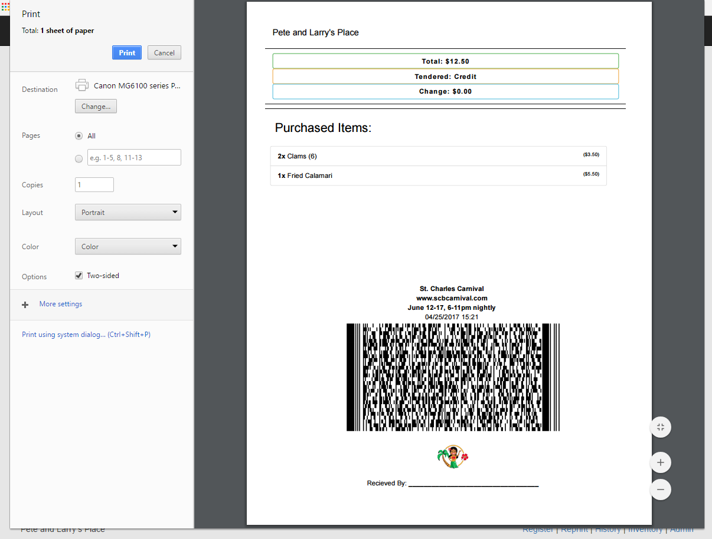

# SCBCarnivalPPPOS - SCB Carnival Pete's Place POS
A very basic Point of Sale (POS) system for the Pete and Larry's Place bar and grill at the [SCB Carnival](http://scbcarnival.com).

All menu items are listed in the products.js and then it builds the dynamic touch screen system. It will keep a running receipt of what is being ordered, the cost, and calculate the change. 

# Modifying 
Simply edit the products.js. Create a list of objects as shown in the sample. The ID must be unique for receipt purposes.

Each product must also have a year key. This again is for historical data purposes. Only products with a year matching the universal config section at the end are shown.

The universal config section brands the site and receipt.

# Use
You can download everything and upload it to a web server if you choose. Otherwise, download and open the index.html file in Edge or Chrome or another standard browser. 

It is built on bootstrap and jquery so should be compatible with the same browsers.

When printing a receipt, a bar code is created at the bottom using an encrypted string from the products, prices, tendered, etc in PDF417 format. After printing, you can scan it with an app on your phone such as [this Android app](https://play.google.com/store/apps/details?id=mobi.pdf417). Once scanned, copy that string and paste it into the first box on the decrypt.html page. Pressing the green button will decrypt the text. Pressing the orange button does that and then correlates that data with the actual product page.

# Try it:
[http://graboskyc.github.io/SCBCarnivalPPPOS/](http://graboskyc.github.io/SCBCarnivalPPPOS/)

# Screenshots

