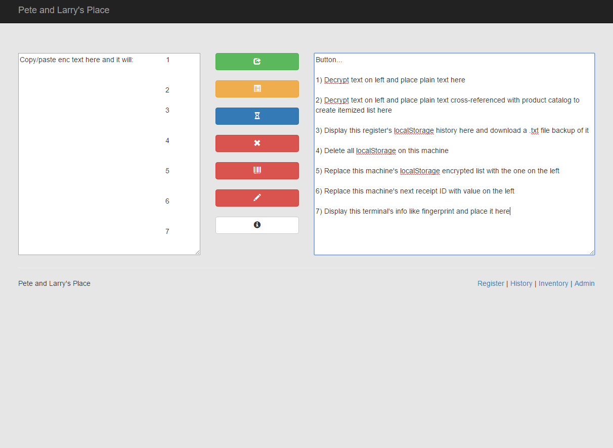

# SCBCarnivalPPPOS - SCB Carnival Pete's Place POS
A very basic Point of Sale (POS) system for the Pete and Larry's Place bar and grill at the [SCB Carnival](http://scbcarnival.com).

All menu items are listed in the products.js and then it builds the dynamic touch screen system. It will keep a running receipt of what is being ordered, the cost, and calculate the change. 

*No server or databases required, although if you have them additional features become available.*

# How To
## Setting your products and branding
Simply edit the products.js. Create a list of objects as shown in the sample. The ID must be unique for receipt purposes. Each product must also have a year key. This again is for historical data purposes. Only products with a year matching the universal config section at the end are shown.

The universal config section brands the site and receipt.

An example for a product is: `{"id":1,"name":"Clams (6)","price":"3.50","itemType":"food", "years":[2016,2017]}` and note that:
* `id` must be unique for each product
* `name` is what is shown on the touch screen
* `price` is a string, no dollar sign, and should be float(2) as shown
* `itemType` defines the background icon and color. Valid options are `food`, `draft`, `bottle`, `na`, `util` and are defined in `css\pos.css`
* `years` is an integer array for what years this has been on the menu. Only ones with the matching value of `menuyear` in the universal config section are shown in the system. 

Also at the bottom of the file is the site branding. These values define what gets printed on the receipt, is in the title bar, etc. Here, `menuyear` is important as it defines what items in the product list are visible (only those with the matching value in the `year` array of each product is shown). However it also defines the logo on the receipt. Place the logo in the `images` folder named `logo_yyyy.png` where `yyyy` matches your `menuyear` such as `logo_2017.png`.

If using locally, you are done! If you upload to a server and want advanced features, also edit `save.php` and enter credentials to a mySQL server with a table created from the definition in `samplesql.sql`. This means on every use, it will upload to the server each receipt. 

## Deployment
You can download everything and upload it to a web server if you choose. Otherwise, download and open the index.html file in Edge or Chrome or another standard browser. It is built on bootstrap and jquery so should be compatible with the same browsers.

When using locally or on the web, all receipt that are printed or saved get stored into localStorage. The history page and the admin page will let you see what is in that localStorage. This is still true if used on a server. However on a webserver you have the extra option of saving to a mySQL database. See the section above on how to configure that.

## Printing and scanning
When printing a receipt, a bar code is created at the bottom using an encrypted string from the products, prices, tendered, etc in PDF417 format. After printing, you can scan it with an app on your phone such as [this Android app](https://play.google.com/store/apps/details?id=mobi.pdf417). Once scanned, copy that string and paste it into the first box on the admin.html page. Pressing the green button will decrypt the text. Pressing the orange button does that and then correlates that data with the actual product page.

# Try it:
[http://graboskyc.github.io/SCBCarnivalPPPOS/](http://graboskyc.github.io/SCBCarnivalPPPOS/)

# Screenshots

# Third Party Libraries
* [Bootstrap](http://getbootstrap.com)
* [jQuery](http://jquery.com/)
* [Crypto.js](code.google.com/p/crypto-js)
* [BCMath](https://sourceforge.net/projects/bcmath-js/)
* [Fingerprintjs2](https://github.com/Valve/fingerprintjs2)
* [pdf417 js](https://github.com/bkuzmic/pdf417-js)
* [FileSaver.js](https://github.com/eligrey/FileSaver.js)
* [DataTables](https://datatables.net/)